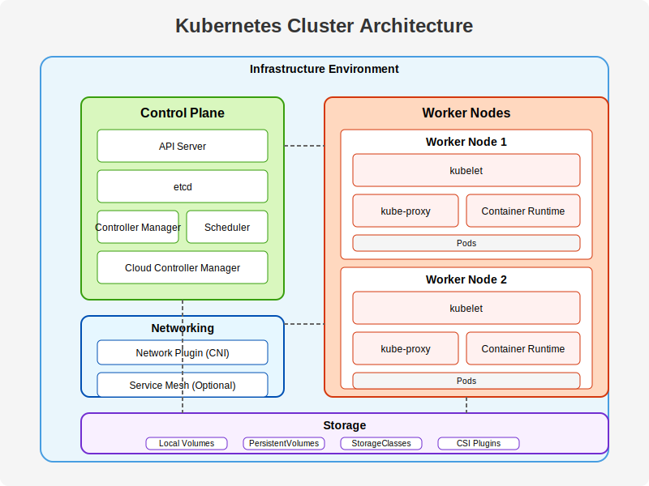

# Kubernetes Cluster Automation with Terraform and Ansible

A complete Infrastructure as Code (IaC) solution for deploying and managing Kubernetes clusters using Terraform for VM provisioning and Ansible for cluster configuration on libvirt/KVM.



## 🏗️ Architecture Overview

This project creates a production-ready Kubernetes cluster with the following architecture:

- **Control Plane Node**: k8scpnode1 (Master node)
- **Worker Nodes**: k8swrknode1, k8swrknode2 (Configurable)
- **Container Runtime**: containerd (Latest version)
- **CNI Plugin**: Flannel (with Calico option)
- **Pod Network CIDR**: 10.244.0.0/16
- **Infrastructure**: libvirt/KVM virtual machines
- **Base OS**: Ubuntu 20.04 LTS (Focal Fossa)

### Key Features

✅ **Fully Automated Deployment** - One-command cluster setup  
✅ **Infrastructure as Code** - Terraform for VM management  
✅ **Configuration Management** - Ansible for K8s setup  
✅ **Production Ready** - Security hardening and best practices  
✅ **Scalable** - Easy to add/remove worker nodes  
✅ **Cloud-init** - Automated VM provisioning and configuration  
✅ **CNI Flexibility** - Support for Flannel and Calico  
✅ **Monitoring Ready** - Verification and health checks included  

## 📋 Prerequisites

### System Requirements

- **Host OS**: Linux (Ubuntu/Debian/RHEL/CentOS)
- **RAM**: Minimum 8GB (Recommended 16GB+)
- **CPU**: 4+ cores with virtualization support (Intel VT-x/AMD-V)
- **Storage**: 50GB+ free space
- **Network**: Internet connectivity for package downloads

### Required Software

1. **Terraform** (>= 1.9)
2. **Ansible** (>= 2.9)
3. **libvirt** and **KVM** with virtualization enabled
4. **Git** for cloning the repository
5. **SSH key pair** (ed25519 recommended)

### Installation Commands (Ubuntu/Debian)

```bash
# Update system packages
sudo apt update && sudo apt upgrade -y

# Install virtualization packages
sudo apt install -y qemu-kvm libvirt-daemon-system libvirt-clients bridge-utils virt-manager
sudo usermod -aG libvirt $USER
sudo usermod -aG kvm $USER

# Install Terraform
wget -O- https://apt.releases.hashicorp.com/gpg | sudo gpg --dearmor -o /usr/share/keyrings/hashicorp-archive-keyring.gpg
echo "deb [signed-by=/usr/share/keyrings/hashicorp-archive-keyring.gpg] https://apt.releases.hashicorp.com $(lsb_release -cs) main" | sudo tee /etc/apt/sources.list.d/hashicorp.list
sudo apt update && sudo apt install terraform

# Install Ansible
sudo apt update && sudo apt install ansible

# Install Git and other utilities
sudo apt install -y git curl wget

# Verify installations
terraform version
ansible --version
virsh --version
```

### SSH Key Setup

```bash
# Generate SSH key pair (if not exists)
ssh-keygen -t ed25519 -f ~/.ssh/id_ed25519 -N ""

# Verify SSH key
ls -la ~/.ssh/id_ed25519*
```

## 🚀 Quick Start

### 1. Clone the Repository

```bash
git clone <repository-url>
cd k8s_cluster
```

### 2. Deploy Complete Cluster (Automated)

```bash
# Make deployment script executable
chmod +x scripts/deploy-k8s-cluster.sh

# Deploy everything with one command
./scripts/deploy-k8s-cluster.sh deploy
```

### 3. Verify Cluster Status

```bash
# Check cluster status
./scripts/deploy-k8s-cluster.sh status

# Or manually check
ansible k8s_control_plane -m shell -a "kubectl get nodes -o wide" -b --become-user=ubuntu
```

### 4. Access the Cluster

```bash
# SSH to control plane
ssh ubuntu@$(grep k8scpnode inventory.ini | awk '{print $2}' | cut -d'=' -f2)

# Use kubectl commands
kubectl get nodes
kubectl get pods -A
kubectl cluster-info
```

### 5. Cleanup (Optional)

```bash
# Destroy all infrastructure
./scripts/deploy-k8s-cluster.sh destroy
```

## 🔧 Manual Deployment (Step by Step)

If you prefer manual control over the deployment process:

### Step 1: Deploy Infrastructure with Terraform

```bash
cd tf_libvirt

# Initialize Terraform
terraform init

# Review planned changes
terraform plan

# Apply infrastructure changes
terraform apply

# View created resources
terraform output
terraform show
```

### Step 2: Verify VM Creation

```bash
# Check VMs are running
virsh list --all

# Verify inventory file was created
cat ../inventory.ini

# Test connectivity
cd ..
ansible all -m ping
```

### Step 3: Setup Kubernetes Cluster

```bash
# Run complete setup
ansible-playbook scripts/site.yml -v

# Or run individual playbooks
ansible-playbook scripts/prepare-nodes.yml
ansible-playbook scripts/setup-control-plane.yml
ansible-playbook scripts/setup-workers.yml
ansible-playbook scripts/verify-cluster.yml
```

## 📁 Project Structure

```
k8s_cluster/
├── 📄 README.md                       # This documentation
├── 📄 LICENSE                         # Project license
├── 📄 ansible.cfg                     # Ansible configuration
├── 📄 inventory.ini                   # Generated Ansible inventory
├── 📄 requirements.yml                # Ansible Galaxy requirements
├── 📄 test-syntax.sh                  # Syntax validation script
├── 📄 focal-server-cloudimg-amd64.img # Ubuntu cloud image
│
├── 📁 tf_libvirt/                     # Terraform Infrastructure
│   ├── 📄 Provider.tf                 # Terraform providers
│   ├── 📄 Variables.tf                # Variable definitions
│   ├── 📄 Cloudinit.tf               # Cloud-init configuration
│   ├── 📄 Volume.tf                   # Storage volumes
│   ├── 📄 Domain.tf                   # VM definitions
│   ├── 📄 Output.tf                   # Output values
│   ├── 📄 start.sh                    # Quick start script
│   ├── 📄 destroy.sh                  # Quick destroy script
│   └── 📁 templates/
│       ├── 📄 user-data.yml           # Cloud-init user data
│       ├── 📄 netplan.yml             # Network configuration
│       └── 📄 inventory.tpl           # Inventory template
│
├── 📁 scripts/                        # Ansible Automation
│   ├── 📄 deploy-k8s-cluster.sh       # Main deployment script
│   ├── 📄 site.yml                    # Master playbook
│   ├── 📄 prepare-nodes.yml           # Node preparation
│   ├── 📄 setup-control-plane.yml     # Control plane setup
│   ├── 📄 setup-workers.yml           # Worker nodes setup
│   ├── 📄 verify-cluster.yml          # Cluster verification
│   ├── 📄 CNI_Calico.sh              # Calico CNI installer
│   ├── 📄 setup_k8s_control.sh       # Control setup script
│   ├── 📄 setup_k8s_worker.sh        # Worker setup script
│   ├── 📄 validate-cluster.sh         # Validation script
│   └── 📄 cluster-setup-summary.txt   # Generated summary
│
└── 📁 attachments/                    # Documentation assets
    ├── 🖼️ k8s_architecture.svg        # Architecture diagram
    └── 🖼️ *.png, *.jpg               # Screenshots and images
```

## 🛠️ Configuration Details

### Terraform Variables (`tf_libvirt/Variables.tf`)

```hcl
locals {
    # Ubuntu cloud image source
    cloud_image = "https://cloud-images.ubuntu.com/focal/current/focal-server-cloudimg-amd64.img"
    
    # Virtual Machines to create
    VMs = toset(["k8scpnode1", "k8swrknode1", "k8swrknode2"])
    
    # VM Specifications
    vcpu     = 2                    # Virtual CPUs per VM
    vmem     = 2048                 # Memory in MB per VM
    vol_size = 20 * 1024 * 1024 * 1024  # 20GB disk per VM
    
    # Network and Security
    ssh_port = 22                   # SSH port
    timezone = "Africa/Tunis"       # VM timezone
    gh_user  = "bios"              # GitHub username for SSH keys
}
```

### Ansible Configuration (`ansible.cfg`)

```ini
[defaults]
inventory = inventory.ini
host_key_checking = False
remote_user = ubuntu
private_key_file = /home/bios/.ssh/id_ed25519
stdout_callback = yaml
timeout = 30
gathering = smart
fact_caching = memory

[ssh_connection]
ssh_args = -o StrictHostKeyChecking=no -o UserKnownHostsFile=/dev/null
pipelining = True
control_path_dir = /tmp/.ansible-cp
```

### Kubernetes Configuration

- **Kubernetes Version**: Latest stable (automatically detected)
- **Container Runtime**: containerd with systemd cgroups
- **Pod Network**: 10.244.0.0/16 (Flannel)
- **Service Network**: 10.96.0.0/12 (default)
- **CNI Plugin**: Flannel (default) or Calico (optional)

## 🔍 Playbook Descriptions

### 1. `site.yml` - Master Orchestrator
Main playbook that coordinates the entire setup process by calling other playbooks in sequence.

### 2. `prepare-nodes.yml` - Node Preparation
- **System Updates**: Updates package cache and installs required packages
- **Firewall Configuration**: Configures UFW for control plane and worker nodes
- **Container Runtime**: Installs and configures containerd with proper cgroup driver
- **Kubernetes Installation**: Adds K8s repository and installs kubelet, kubeadm, kubectl
- **System Configuration**: Disables swap, loads kernel modules, configures networking

### 3. `setup-control-plane.yml` - Control Plane Setup
- **Cluster Initialization**: Runs `kubeadm init` with pod network CIDR
- **Kubeconfig Setup**: Configures kubectl access for ubuntu and root users
- **CNI Installation**: Deploys Flannel network plugin
- **Join Command Generation**: Creates join command for worker nodes
- **Verification**: Displays cluster information and status

### 4. `setup-workers.yml` - Worker Node Setup
- **Node Joining**: Joins worker nodes to the cluster using generated command
- **Verification**: Confirms nodes joined successfully
- **Status Display**: Shows updated cluster node status

### 5. `verify-cluster.yml` - Cluster Verification
- **Health Checks**: Verifies all nodes are ready and components are running
- **Information Gathering**: Collects cluster info, node status, pod status, services
- **Report Generation**: Creates comprehensive cluster setup summary
- **Local Copy**: Fetches summary report to local machine

## 🌐 Network Configuration

### Firewall Rules

**Control Plane Nodes:**
```bash
6443/tcp        # Kubernetes API server
2379:2380/tcp   # etcd server client API
10250/tcp       # Kubelet API
10259/tcp       # kube-scheduler
10257/tcp       # kube-controller-manager
```

**Worker Nodes:**
```bash
10250/tcp       # Kubelet API
10256/tcp       # kube-proxy
30000:32767/tcp # NodePort Services
8472/udp        # Flannel VXLAN
```

### Pod and Service Networks

```yaml
Pod Network (Flannel):     10.244.0.0/16
Service Network:           10.96.0.0/12
VM Network (libvirt):      192.168.122.0/24
```

## 🔐 Security Features

### SSH Security
- **Key-based Authentication**: Only SSH keys allowed, password auth disabled
- **Hardened SSH Config**: Modern ciphers, MAC algorithms, and key exchange
- **User Restrictions**: Only 'ubuntu' user allowed for SSH access
- **Port Configuration**: Configurable SSH port (default: 22)

### System Security
- **Firewall**: UFW configured with minimal required ports
- **Non-root Operations**: Kubernetes runs under 'ubuntu' user
- **Package Holds**: K8s packages held to prevent accidental upgrades
- **Secure Defaults**: StrictHostKeyChecking disabled only for automation

### Container Security
- **Systemd Cgroups**: Proper cgroup driver configuration
- **Containerd**: Latest stable version with security updates
- **Image Security**: Uses official Ubuntu cloud images
- **Network Policies**: Ready for additional network security policies

## 🔧 Advanced Configuration

### Adding More Worker Nodes

1. **Edit Terraform Variables:**
```hcl
# In tf_libvirt/Variables.tf
VMs = toset(["k8scpnode1", "k8swrknode1", "k8swrknode2", "k8swrknode3"])
```

2. **Apply Infrastructure Changes:**
```bash
cd tf_libvirt
terraform plan
terraform apply
```

3. **Setup New Nodes:**
```bash
cd ..
ansible-playbook scripts/prepare-nodes.yml --limit k8swrknode3
ansible-playbook scripts/setup-workers.yml --limit k8swrknode3
```

### Changing CNI to Calico

1. **Run Calico Installation Script:**
```bash
# SSH to control plane node
ssh ubuntu@<control-plane-ip>

# Switch to Calico CNI
bash /path/to/CNI_Calico.sh
```

2. **Or Modify setup-control-plane.yml:**
Replace Flannel installation with Calico manifest application.

### Custom VM Specifications

```hcl
# Modify in tf_libvirt/Variables.tf
locals {
    vcpu     = 4        # More CPU cores
    vmem     = 4096     # More RAM (4GB)
    vol_size = 50 * 1024 * 1024 * 1024  # Larger disk (50GB)
}
```

### Multi-Master Setup (HA)

For high availability, modify the VMs list to include multiple control plane nodes:

```hcl
VMs = toset(["k8scp1", "k8scp2", "k8scp3", "k8swrk1", "k8swrk2"])
```

*Note: Additional configuration required for load balancer and etcd clustering.*

## 🚨 Troubleshooting

### Common Issues and Solutions

#### 1. SSH Connection Failures
```bash
# Check VM status
virsh list --all

# Verify SSH key permissions
chmod 600 ~/.ssh/id_ed25519
chmod 644 ~/.ssh/id_ed25519.pub

# Test manual connection
ssh -i ~/.ssh/id_ed25519 ubuntu@<vm-ip>

# Check Ansible connectivity
ansible all -m ping -vvv
```

#### 2. Terraform Provider Issues
```bash
# Update provider cache
cd tf_libvirt
terraform init -upgrade

# Clear provider cache if needed
rm -rf .terraform
terraform init
```

#### 3. libvirt Permission Issues
```bash
# Add user to libvirt group
sudo usermod -aG libvirt $USER
sudo usermod -aG kvm $USER

# Restart libvirt service
sudo systemctl restart libvirtd

# Re-login or reboot
newgrp libvirt
```

#### 4. Kubernetes Cluster Issues
```bash
# Check node status
kubectl get nodes -o wide

# Check pod status
kubectl get pods -A

# Check cluster events
kubectl get events --sort-by=.metadata.creationTimestamp

# Reset cluster if needed (on control plane)
sudo kubeadm reset
sudo rm -rf /etc/kubernetes/
```

#### 5. Flannel CNI Problems
```bash
# Check Flannel pods
kubectl get pods -n kube-flannel

# Restart Flannel
kubectl delete pods -n kube-flannel -l app=flannel

# Check Flannel logs
kubectl logs -n kube-flannel -l app=flannel
```

#### 6. VM Resource Issues
```bash
# Check host resources
free -h
df -h
lscpu

# Check VM resource allocation
virsh dominfo <vm-name>

# Modify VM resources if needed
virsh setmem <vm-name> 4194304  # 4GB RAM
virsh setvcpus <vm-name> 4      # 4 CPU cores
```

### Debug Mode

Enable verbose output for detailed troubleshooting:

```bash
# Terraform debug
export TF_LOG=DEBUG
terraform apply

# Ansible debug
ansible-playbook scripts/site.yml -vvv

# Deployment script debug
bash -x scripts/deploy-k8s-cluster.sh deploy
```

### Log Locations

```bash
# System logs
journalctl -u kubelet -f
journalctl -u containerd -f

# Kubernetes logs
kubectl logs -n kube-system <pod-name>

# Cloud-init logs (on VMs)
sudo tail -f /var/log/cloud-init-output.log
```

## 📊 Monitoring and Maintenance

### Built-in Monitoring

The cluster includes basic monitoring capabilities:

- **Node Status Monitoring**: Regular health checks via kubectl
- **Pod Status Tracking**: Automatic verification of system pods
- **Cluster Information**: Detailed cluster info and configuration
- **Resource Usage**: Basic resource utilization tracking

### Health Check Commands

```bash
# Check cluster health
kubectl get componentstatuses

# Check node resources
kubectl top nodes

# Check pod resources (requires metrics-server)
kubectl top pods -A

# Check cluster info
kubectl cluster-info
kubectl cluster-info dump
```

### Maintenance Tasks

#### Regular Updates

```bash
# Update VM packages (run on each node)
sudo apt update && sudo apt upgrade -y

# Update Kubernetes components (carefully planned)
# Note: Follow Kubernetes upgrade procedures
```

#### Backup Recommendations

```bash
# Backup etcd (on control plane)
sudo ETCDCTL_API=3 etcdctl snapshot save /backup/etcd-snapshot-$(date +%Y%m%d-%H%M%S).db \
  --endpoints=https://127.0.0.1:2379 \
  --cacert=/etc/kubernetes/pki/etcd/ca.crt \
  --cert=/etc/kubernetes/pki/etcd/healthcheck-client.crt \
  --key=/etc/kubernetes/pki/etcd/healthcheck-client.key

# Backup certificates
sudo tar -czf /backup/k8s-certs-$(date +%Y%m%d).tar.gz /etc/kubernetes/pki/
```

### Production Readiness Enhancements

For production environments, consider adding:

#### Monitoring Stack
```bash
# Prometheus and Grafana
kubectl apply -f https://raw.githubusercontent.com/prometheus-operator/prometheus-operator/main/bundle.yaml

# Metrics Server
kubectl apply -f https://github.com/kubernetes-sigs/metrics-server/releases/latest/download/components.yaml
```

#### Logging Stack
```bash
# ELK Stack or Fluentd
# Centralized logging solution
```

#### Security Enhancements
```bash
# Network Policies
# Pod Security Policies
# RBAC (Role-Based Access Control)
# Secrets management (e.g., Vault)
```

## 🤝 Contributing

Contributions are welcome! Please follow these guidelines:

1. **Fork the Repository**
2. **Create Feature Branch**: `git checkout -b feature/amazing-feature`
3. **Commit Changes**: `git commit -m 'Add amazing feature'`
4. **Push to Branch**: `git push origin feature/amazing-feature`
5. **Open Pull Request**

### Development Setup

```bash
# Clone your fork
git clone https://github.com/your-username/k8s-cluster.git
cd k8s-cluster

# Install pre-commit hooks (optional)
pip install pre-commit
pre-commit install

# Test syntax
./test-syntax.sh
```

## 📝 License

This project is licensed under the MIT License - see the [LICENSE](LICENSE) file for details.

## 🙏 Acknowledgments

- **Kubernetes Community** for the amazing orchestration platform
- **Terraform** and **HashiCorp** for infrastructure automation
- **Ansible** and **Red Hat** for configuration management
- **Ubuntu** for the reliable cloud images
- **libvirt/KVM** for virtualization capabilities

## 📞 Support

- **Issues**: Please open an issue on GitHub for bug reports or feature requests
- **Documentation**: Check this README and inline code comments
- **Community**: Engage with the Kubernetes and DevOps communities

---

**Happy Kubernetes Clustering! 🚀**
